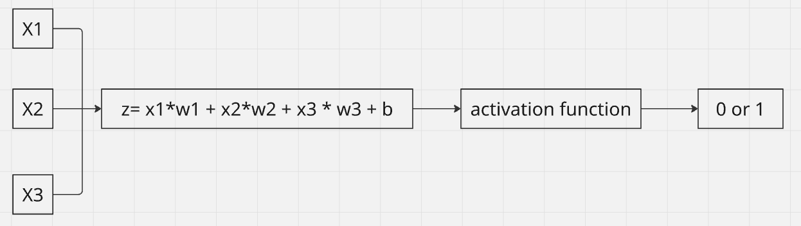
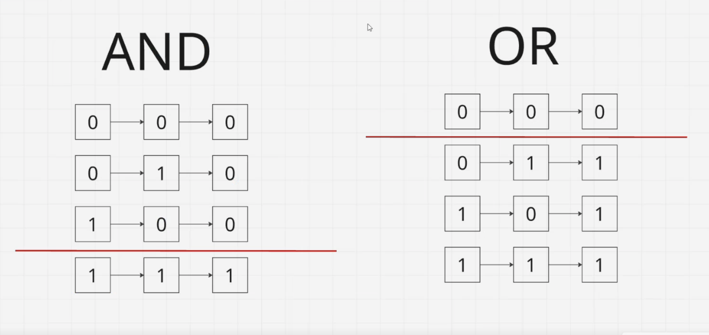

# Что такое Нейронные сети?

Нейронные сети (нейросети) — это математические модели в искусственном интеллекте, построенные по принципу работы биологических нейронных сетей человеческого мозга. Они состоят из множества связанных между собой элементов — искусственных нейронов. Сети обучаются на данных, что позволяет им распознавать образы, переводить тексты, генерировать контент и автоматизировать задачи.

Варианты обучения моделей машинного обучения (ML) делятся по степени участия человека на три основных типа: 
- с учителем (разметка данных)
- без учителя (поиск скрытых закономерностей) 
- с подкреплением (через систему наград и штрафов). 

---

## Обучение с учителем (Supervised Learning)

Модель обучается на размеченных данных, где каждому примеру соответствует правильный ответ. 
Задачи: Классификация (разделение по категориям), регрессия (предсказание числовых значений).

---

## Обучение без учителя (Unsupervised Learning)

Модели предоставляются неразмеченные данные без подсказок и правильных ответов. Она сама ищет структуры, аномалии или связи.
Задачи: Кластеризация (объединение похожих объектов в группы), снижение размерности, поиск ассоциаций.

---

## Обучение с подкреплением (Reinforcement Learning)

Агент взаимодействует со средой, совершая действия. За правильные действия он получает награду, за ошибки — штраф. Метод проб и ошибок вырабатывает стратегию поведения.
Применение: Обучение роботов, управление беспилотниками, игры (например, шахматы или Go), оптимизация логистических цепочек.

---

# Специализированные подходы и стратегии

----

## Обучение с частичным привлечением учителя (Semi-Supervised Learning)

Гибридный подход: используется огромный массив неразмеченных данных и совсем небольшая часть размеченных, что экономит ресурсы на разметку.

---

## Self-supervised learning (самообучение) 

Метод машинного обучения, где модель искусственного интеллекта обучается на неразмеченных данных. Вместо меток, созданных человеком, алгоритм сам генерирует целевые задачи (например, предсказывает скрытую часть текста или изображения), извлекая правильные ответы из самой структуры данных.

---

## Трансферное обучение (Transfer Learning / Дообучение) (дополнительно)

Берется готовая базовая модель (например, обученная на миллионах изображений или текстов), «замораживается» часть её весов, а верхние слои дообучаются под узкую специфическую задачу заказчика.

---

## Активное обучение (Active Learning) (дополнительно)

Модель сама выбирает из потока неразмеченных данных самые сложные или сомнительные случаи и просит эксперта (человека) разметить именно их, обучаясь максимально эффективно на меньшем объеме данных.

---

# Перцептрон (1957)

Перцептрон — это простейшая математическая модель искусственного нейрона, предложенная Фрэнком Розенблаттом в 1957 году. Он принимает на вход несколько числовых сигналов, умножает их на веса, суммирует результат с пороговым значением (сдвигом) и при помощи функции активации выдает один двоичный выход. 

## Однослойный персептрон (Single Layer Perceptron, SLP)

Она состоит из одного слоя искусственных нейронов, выполняет функции линейного классификатора и применяется для разделения данных на два класса (двоичная классификация).


Формула:

$$
y = f(w_1x_1 + w_2x_2 + ... + w_nx_n + b)
$$

Где:

- **x** — признаки (входные данные)
- **w** — веса (важность признаков)
- **b (bias)** — смещение
- **f** — функция активации
- **y** — результат (предсказание)

---

## Как работает нейрон

1. Получает входные данные $x$.
2. Умножает каждый признак на соответствующий вес $w$.
3. Складывает полученные значения.
4. Добавляет смещение $b$.
5. Передаёт результат в функцию активации $f$.
6. Получает итоговое предсказание $y$. (0 или 1)



---

## Роль компонентов

### Веса (Weights)

Определяют важность каждого признака.

- большой вес → сильное влияние на результат;
- маленький вес → слабое влияние;
- отрицательный вес → уменьшает вероятнось класса. 

### Смещение (Bias)

Не привязывает модель к нулю и позволяет сдвигать результат независимо от входных данных.

### Функция активации

Решает, каким будет выход нейрона.

Примеры:

- Sigmoid
- ReLU
- Tanh
- Softmax

---

### Код

```python
model = Perceptron()
model.fit(X, y)
```

---

### Заметка

Работает с and и or. Можно решить одной линией. 



