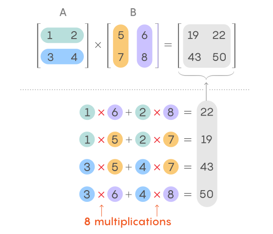

## Многослойный перцептрон (MLP — Multi-Layer Perceptron) 

Сеть состоит как минимум из трех слоев: входного, одного или нескольких скрытых и выходного, где каждый нейрон связан с каждым нейроном следующего слоя. Обучение происходит методом обратного распространения ошибки.

Формула:

$$
y = f(Wx + b)
$$

Где:

- **x** — входные данные
- **W** — веса
- **b** — смещение (bias)
- **f** — функция активации
- **y** — выход нейрона

---

## Структура нейросети

```text
Inputs → Hidden Layer → Hidden Layer → ... → Output
```

- Input Layer : входные признаки.
- Hidden Layer : скрытые слои, которые извлекают закономерности из данных.
- Output Layer : формирует итоговое предсказание.

---

## Зачем нужны скрытые слои?

Позволяют моделировать сложные нелинейные зависимости.

Чем больше скрытых слоёв и нейронов, тем более сложные закономерности может изучить сеть.

---

### Заметка

Можно работать с XOR, так как его нельзя корректно разделить одной линейной границей.

Поэтому для решения XOR используют нейронную сеть со скрытым слоем.


---

## MLPClassifier

```python
model = MLPClassifier(
    hidden_layer_sizes=(5,),
    activation="tanh",
    max_iter=3000
)
```

### Параметры

#### hidden_layer_sizes=(5,)

Скрытый слой из 5 нейронов.

#### activation="tanh"

Функция активации Hyperbolic Tangent:

$$
tanh(x)
$$

Диапазон:

$$
-1 \le y \le 1
$$

#### max_iter=3000

Максимальное количество итераций обучения.

---

# Функции активации подробнее в 13.ipynb

## ReLU (Rectified Linear Unit)

$$
ReLU(x)=
\begin{cases}
0, & x < 0 \\
x, & x \ge 0
\end{cases}
$$

- Если $x < 0$ → 0
- Если $x > 0$ → $x$

---

## tanh (Hyperbolic Tangent)

Диапазон значений:

$$
-1 \le tanh(x) \le 1
$$

- Отрицательные входы → отрицательные выходы
- Положительные входы → положительные выходы

---

## Sigmoid

Диапазон значений:

$$
0 \le \sigma(x) \le 1
$$

Примеры:

$$
x = -100
$$

$$
sigmoid(x) = 0
$$

$$
x = 0
$$

$$
sigmoid(x) = 0.5
$$

$$
x = 100
$$

$$
sigmoid(x) = 1
$$

### Кратко

| Функция | Диапазон |
|----------|----------|
| ReLU | $[0, +\infty)$ |
| tanh | $[-1, 1]$ |
| Sigmoid | $[0, 1]$ |

---

## Back propagation (метод обратного распространения ошибки) 

Back propagation (метод обратного распространения ошибки) — это фундаментальный алгоритм обучения нейротей, который вычисляет градиент функции потерь. Он проходит по сети от выхода к входу с помощью правила дифференцирования сложной функции, позволяя корректировать внутренние веса для минимизации ошибок.

Простыми словами: нейронная сеть делает предсказание, после чего сравнивает его с правильным ответом и вычисляет ошибку. Затем эта ошибка передаётся назад по сети, чтобы определить, какие веса внесли наибольший вклад в ошибочный результат. После этого веса корректируются так, чтобы в следующий раз ошибка стала меньше.

---

## Схема обучения нейронной сети

- Forward propagation — выполнить прямой проход и получить предсказание.
- Loss function — вычислить ошибку предсказания.
- Backpropagation — вычислить градиенты для всех весов сети. (насколько ошиблись веса)
- Gradient descent — обновить веса в направлении уменьшения ошибки.
- Повторять процесс много раз, пока модель не начнёт давать хорошие результаты.


## Функции активации

### ReLU

$$
ReLU(x)=\max(0,x)
$$

- отрицательные значения → 0
- положительные значения → остаются без изменений

### Sigmoid

$$
\sigma(x)=\frac{1}{1+e^{-x}}
$$

Возвращает вероятность:

$$
0 \le P \le 1
$$

---

## Инициализация весов

### He Initialization

Весы инициализируются случайными значениями:

$$
W \sim N\left(0,\sqrt{\frac{2}{n}}\right)
$$

Используется для сетей с ReLU.

---

## Forward Propagation

### Скрытый слой

$$
Z_1=XW_1+b_1
$$

$$
A_1=ReLU(Z_1)
$$

### Выходной слой

$$
Z_2=A_1W_2+b_2
$$

$$
A_2=Sigmoid(Z_2)
$$

---

## Loss Function

Используется Binary Cross Entropy:

$$
Loss=
-\frac1m
\sum
\left[
y\log(\hat y)
+
(1-y)\log(1-\hat y)
\right]
$$

---

## Backward Propagation

### Ошибка выходного слоя

$$
dZ_2=A_2-y
$$

### Градиенты выходного слоя

$$
dW_2=\frac{A_1^TdZ_2}{m}
$$

$$
db_2=\frac{\sum dZ_2}{m}
$$

### Ошибка скрытого слоя

$$
dA_1=dZ_2W_2^T
$$

$$
dZ_1=dA_1 \cdot ReLU'(Z_1)
$$

### Градиенты скрытого слоя

$$
dW_1=\frac{X^TdZ_1}{m}
$$

$$
db_1=\frac{\sum dZ_1}{m}
$$

---

## Gradient Descent

Обновление параметров:

$$
W=W-\eta dW
$$

$$
b=b-\eta db
$$

где:

- $\eta$ — learning rate
- в примере:

```python
lr = 0.1
```

---

## Заметки 

### Матричное умножение


```python
A = np.array([[1, 2], 
              [3, 4]])

B = np.array([[5, 6], 
              [7, 8]])

# Умножение матриц через оператор @
result = A @ B
```


### Транспонирование

Транспонирование меняет строки и столбцы местами.

```python

matrix = np.array([
    [1, 2, 3],
    [4, 5, 6]
])

# Самый простой способ — атрибут .T
transposed = matrix.T

# Выведет:
# [[1, 4]
#  [2, 5]
#  [3, 6]]
```


