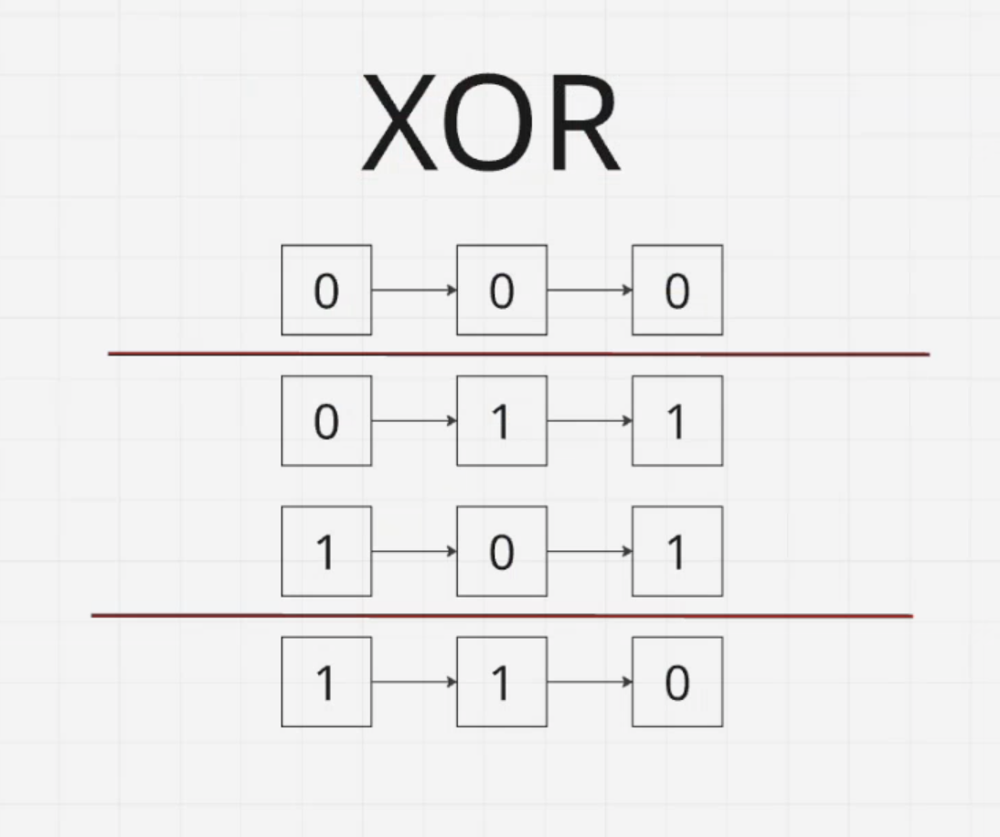

## Многослойный перцептрон (MLP — Multi-Layer Perceptron) 

Сеть состоит как минимум из трех слоев: входного, одного или нескольких скрытых и выходного, где каждый нейрон связан с каждым нейроном следующего слоя. Обучение происходит методом обратного распространения ошибки.

Формула:

$$
y = f(Wx + b)
$$

Где:

- **x** — входные данные
- **W** — веса
- **b** — смещение (bias)
- **f** — функция активации
- **y** — выход нейрона

---

## Структура нейросети

```text
Inputs → Hidden Layer → Hidden Layer → ... → Output
```

- Input Layer : входные признаки.
- Hidden Layer : скрытые слои, которые извлекают закономерности из данных.
- Output Layer : формирует итоговое предсказание.

---

## Зачем нужны скрытые слои?

Позволяют моделировать сложные нелинейные зависимости.

Чем больше скрытых слоёв и нейронов, тем более сложные закономерности может изучить сеть.

---

### Заметка

Можно работать с XOR, так как его нельзя корректно разделить одной линейной границей.

Поэтому для решения XOR используют нейронную сеть со скрытым слоем.




---

## MLPClassifier

```python
model = MLPClassifier(
    hidden_layer_sizes=(5,),
    activation="tanh",
    max_iter=3000
)
```

### Параметры

#### hidden_layer_sizes=(5,)

Скрытый слой из 5 нейронов.

#### activation="tanh"

Функция активации Hyperbolic Tangent:

$$
tanh(x)
$$

Диапазон:

$$
-1 \le y \le 1
$$

#### max_iter=3000

Максимальное количество итераций обучения.

---

# Функции активации подробнее в 13.ipynb

## ReLU (Rectified Linear Unit)

$$
ReLU(x)=
\begin{cases}
0, & x < 0 \\
x, & x \ge 0
\end{cases}
$$

- Если $x < 0$ → 0
- Если $x > 0$ → $x$

---

## tanh (Hyperbolic Tangent)

Диапазон значений:

$$
-1 \le tanh(x) \le 1
$$

- Отрицательные входы → отрицательные выходы
- Положительные входы → положительные выходы

---

## Sigmoid

Диапазон значений:

$$
0 \le \sigma(x) \le 1
$$

Примеры:

$$
x = -100
$$

$$
sigmoid(x) \approx 0
$$

$$
x = 0
$$

$$
sigmoid(x) = 0.5
$$

$$
x = 100
$$

$$
sigmoid(x) \approx 1
$$

### Кратко

| Функция | Диапазон |
|----------|----------|
| ReLU | $[0, +\infty)$ |
| tanh | $[-1, 1]$ |
| Sigmoid | $[0, 1]$ |